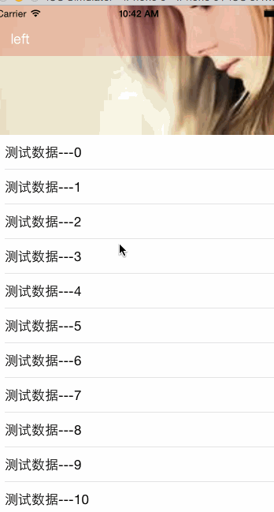

###TableHeaderImage
---------------
###Example

###核心代码如下：
    // 1、 设置导航栏的背景图片
    self.navigation_backgroundImageName = @"navigation_background";
    
    // 2、设置被拉伸图片view的高度
    self.stretchingImageHeight = 200;
    
    // 3、设置头部拉伸图片的名称
    self.stretchingImageName = @"1.jpg";
###感谢
=========
博客地址 | RSS地址
----- | -----
[cocoChina](http://www.cocoachina.com)|<http://www.cocoachina.com/news/>
[github](http://github.com)|<https://github.com/iOSBIGDay/iOS.Big.Day.Communication.High.Bige.Group>